# Quiz Slayer

A console-based educational battle game built in Java. Players fight subject-themed bosses by answering quiz questions. Allowing users to review core subjects while also having fun helping memorization

**Course**: 2190103 Advanced Computer Programming — ISE, Chulalongkorn University

**Project of Group [ _We love Yaoi!!_ ]**

---

## Use Case

The player selects one of seven ICE subjects and is matched against a boss character for that subject. Each turn, a question is drawn from that subject's pool. A correct answer triggers a player attack phase; a wrong answer triggers a boss counter-attack phase. The boss's attack damage escalates as its HP drops. The game ends when either side’s HP is 0 or below.

**Subjects**: 
- Calculus I
- Calculus II
- Physics for Engineers (Physics I)
- Physics and Electronics for Engineers (Physics II)
- Computer Programming
- Advanced Computer Programming
- Probability & Statistics for Data Analysis

---

## How to Play

**Requirements**: Java 11+

**Disclaimer**: Running the game in certain environments (e.g. using a button provided by Java extensions for Visual Studio Code may break some characters depending on the Java extension used (HP Bars (`█████`) are rendered as Question marks instead (`?????`)).

>It is recommended to run the command below in a terminal instead.
### Unix
```
javac -d bin App.java && java -cp bin App
```
### Windows
```
javac -d bin App.java ; java -cp bin App 
```

## Design Patterns

### 1. Strategy

#### 1.1 Strategy — Question Types
`attacks/question/strategies/`

The `QuestionStrategy` interface defines two methods: `askQuestion(...)` and `isCorrect(...)`. Each concrete strategy handles its own display and validation logic.

| Class | Type | Validation |
|---|---|---|
| `MultipleChoiceQuestionStrategy` | 4-option numbered choice | Matches selected option by index |
| `TrueFalseQuestionStrategy` | True / False | Case-insensitive first-character match |
| `WrittenQuestionStrategy` | Free text | Case-insensitive exact match (trimmed) |

#### 1.2 Strategy — Boss Behavior
`entities/boss/behavior/`

`BossBehaviorStrategy` defines `calculateDamage()`. `Boss` holds a reference to the current strategy and delegates its `attack()` to it. Strategy swapping is driven externally by `BossBehaviorObserver` (see [Section 3: Observer](#3-observer--entity-observers)), which reacts to HP changes and calls `Boss.setBossBehavior()` with the strategy matching the new HP phase.

Each strategy carries its own `getDialogue()` and `getColor()` so a single class encapsulates the full behaviour of a phase.

| Class | Trigger | Damage Range |
|---|---|---|
| `DefaultBossBehavior` | HP > 50% | 5 (Fixed) |
| `MidHPBossBehavior` | HP 20–50% | 8 - 15 |
| `LowHPBossBehavior` | HP < 20% | 10 - 20 |
| `DefeatBossBehavior` | HP = 0 | 0 (Boss defeated) |

### 2. Singleton

#### 2.1 Singleton — Question Bank
`attacks/question/QuestionBank.java`

`QuestionBank` is initialized as a private static field. `getInstance()` returns that single instance. The class holds a `Map<Subject, Question[]>` pre-loaded with ~50 questions per subject (350+ total), and a second map tracking the remaining shuffled deck per subject so questions don't repeat within a run.

#### 2.2 Singleton — I/O Handler
`game/io/IOHandler.java`

`IOHandler` is initialized as a private static field. `getInstance()` returns that single instance. The class holds several useful utilities for both input and output handling, using a java `Scanner`.


### 3. Observer — Entity Observers
`entities/observers/`

`GameEntity` maintains an `ArrayList<EntityObserver>` and calls `notifyObservers(hpChange)` inside `updateHp()` after every HP modification. 

`EntityObserver` is an interface with a single `onHpChange(GameEntity, double)` method. Observers are registered at startup via `GameSetup` — `Player` gets one, `Boss` gets both:

- **`BossBehaviorObserver`** — tracks phase transitions via an internal `currentPhase` counter. On each HP change, it computes the new phase; if it differs, it swaps the strategy via `setBossBehavior()` and prints the dialogue from the new strategy.

- **`EntityLoggerObserver`** — calls `Visuals.displayStatus()` to redraw the HP bar for whoever just took damage.

---

## OOP Principles

**Abstraction**: `QuestionStrategy` and `BossBehaviorStrategy` are the only things `Battle` and `Boss` interact with, respectively. The concrete implementations are invisible to the callers.

**Encapsulation**: `hp` and `maxHp` are private in `GameEntity`. Nothing outside modifies HP directly; all changes go through `updateHp()`, which clamps the value and fires observers.

**Inheritance**: `Player` and `Boss` both extend `GameEntity`, inheriting HP management and the observer list. `attack()` is declared abstract and overridden differently by each: `Player` scales off its `PlayerGift` stat, `Boss` delegates to its current `BossBehaviorStrategy`.

**Polymorphism**: `Battle` calls `question.askQuestion(io)` and `question.isCorrect(answer)` without ever checking the question type. `GameEntity.attack(target, modifier)` is called uniformly for both player and boss turns.


---

## Package Structure

```
App.java
attacks/
├── AttackResult.java               # Enum: DODGE / HIT / CRITICAL_HIT with damage modifiers
└── question/
    ├── Question.java               # Holds strategy, text, options, answer
    ├── QuestionBank.java           # Singleton; 350+ questions across 7 subjects
    ├── QuoteBank.java              # Boss names, intros, victory/defeat lines per subject
    ├── Subject.java                # Enum for the 7 subjects
    └── strategies/
        ├── QuestionStrategy.java   # Interface: askQuestion(), isCorrect()
        ├── MultipleChoiceQuestionStrategy.java
        ├── TrueFalseQuestionStrategy.java
        └── WrittenQuestionStrategy.java
entities/
├── GameEntity.java                 # Abstract base: HP, observers, attack()
├── Player.java                     # attack() scales off PlayerGift
├── Boss.java                       # attack() depends on different BossBehaviorStrategy
├── PlayerGift.java                 # Enum: INTELLIGENCE / STRENGTH / CHARISMA / NONE
├── boss/behavior/
│   ├── BossBehaviorStrategy.java   # Interface: calculateDamage(), getDialogue(), getColor()
│   ├── DefaultBossBehavior.java
│   ├── MidHPBossBehavior.java
│   ├── LowHPBossBehavior.java
│   └── DefeatBossBehavior.java
└── observers/
    ├── EntityObserver.java         # Interface: onHpChange(GameEntity, double)
    ├── BossBehaviorObserver.java   # Swaps boss strategy on HP threshold; prints phase dialogue
    └── EntityLoggerObserver.java   # Redraws HP bar on any HP change
game/
├── io/IOHandler.java               # Singleton wrapping System.in/out; typing effect, ANSI clear
├── loop/
│   ├── Battle.java                 # Main game loop; handles question, strike, dodge, endgame
│   ├── BodyPart.java               # Enum: HEAD / BODY / LEGS with random selection helpers
│   └── DodgeDirection.java         # Enum: LEFT / RIGHT / DUCK with random selection helpers
├── setup/GameSetup.java            # Registers observers with player and boss
└── ui/
    ├── Menu.java                   # Subject and gift selection menus
    ├── Visuals.java                # Logo, prologue, boss intro, HP bars, endgame screens
    └── TerminalColor.java          # Enum of ANSI color codes with apply() helper
```

---

## Combat Reference

**Correct answer → Player attacks**
- Pick a target: `[1] Head  [2] Body  [3] Legs`
- Boss has one random weak point (Critical Hit, ×2 modifier) and one blocked point (no damage)
- Any other target deals a normal hit (×1 modifier)

**Wrong answer → Boss attacks, player dodges**
- Pick a direction: `[1] Left  [2] Right  [3] Duck`
- One random direction is safe (0 damage), one is a trap (Critical Hit, ×2 modifier)
- Any other direction takes a glancing blow (×1 modifier)

Actual damage = `attackStat × modifier`. Player attack stat is set by chosen `PlayerGift` (STRENGTH: 7, INTELLIGENCE/CHARISMA/NONE: 5). Boss damage comes from `BossBehaviorStrategy.calculateDamage()`.

**Player Gifts** grant a passive bonus:
- **INTELLIGENCE** — one free retry if the first answer is wrong. Additionally adds 0.25 to the modifier on critical hit and deducts 0.5 from the modifier when boss critical hits.
- **STRENGTH** — higher base attack stat (7 vs 5).
- **CHARISMA** — boss hints at a non-weak-point / non-safe direction before each phase.
- **NONE** — "Hard Mode". No bonuses;
---

## AI Usage Disclosure

- **Question content**: AI-generated questions for all seven subjects
- **Technical Auditing**: AI assisted with spotting basic issues (spelling, consistency, etc.) as well as providing slight architectural feedback within the code before effects escalated.
- **Documentation**: AI generated and edited the README and class diagram
- **Flavor Text**: AI assisted with some dialogues used 

Core decisions and implementation were ideated and done by the group.

**Models used**: Several models from Anthropic (Claude) and Google (Gemini)

# Class Diagram

```mermaid
classDiagram
    %% ── ENTITY LAYER ───────────────────────────────────────────────────────────

    class GameEntity {
        <<abstract>>
        #observers : ArrayList~EntityObserver~
        -maxHp : double
        -hp : double
        -name : String
        +getHp() double
        +getMaxHp() double
        +getName() String
        +setName(name : String) void
        +addObserver(observer : EntityObserver) void
        +removeObserver(observer : EntityObserver) void
        #notifyObservers(hpChange : double) void
        #updateHp(hpChange : double) void
        +attack(target : GameEntity, modifier : double)* void
    }

    class Player {
        -playerGift : PlayerGift
        +attack(target : GameEntity, modifier : double) void
        +getPlayerGift() PlayerGift
    }

    class Boss {
        -intro : String
        -bossBehavior : BossBehaviorStrategy
        +getIntro() String
        +attack(target : GameEntity, modifier : double) void
        +setBossBehavior(behavior : BossBehaviorStrategy) void
    }

    class PlayerGift {
        <<enumeration>>
        INTELLIGENCE
        STRENGTH
        CHARISMA
        NONE
        -attackStat : int
        -description : String
        -hasRetry : boolean
        -critBonus : double
        -critDamageReduction : double
        -hasCombatHints : boolean
        -hasSpecialVictoryScreen : boolean
        +getAttackStat() int
        +getDescription() String
        +hasRetry() boolean
        +getCritBonus() double
        +getCritDamageReduction() double
        +hasCombatHints() boolean
        +hasSpecialVictoryScreen() boolean
        +toString() String
    }

    %% ── OBSERVER PATTERN (Entity) ──────────────────────────────────────────────

    class EntityObserver {
        <<interface>>
        +onHpChange(entity : GameEntity, hpChange : double) void
    }

    class BossBehaviorObserver {
        -ioHandler : IOHandler
        -boss : Boss
        -currentPhase : int
        +onHpChange(entity : GameEntity, hpChange : double) void
    }

    class EntityLoggerObserver {
        -visuals : Visuals
        +onHpChange(entity : GameEntity, hpChange : double) void
    }

    %% ── BOSS BEHAVIOR STRATEGY ─────────────────────────────────────────────────

    class BossBehaviorStrategy {
        <<interface>>
        +calculateDamage() int
        +getDialogue() String
        +getColor() TerminalColor
    }

    class DefaultBossBehavior {
        +calculateDamage() int
        +getDialogue() String
        +getColor() TerminalColor
    }

    class MidHPBossBehavior {
        -random : Random
        +calculateDamage() int
        +getDialogue() String
        +getColor() TerminalColor
    }

    class LowHPBossBehavior {
        -random : Random
        +calculateDamage() int
        +getDialogue() String
        +getColor() TerminalColor
    }

    class DefeatBossBehavior {
        +calculateDamage() int
        +getDialogue() String
        +getColor() TerminalColor
    }

    %% ── QUESTION STRATEGY PATTERN ──────────────────────────────────────────────

    class QuestionStrategy {
        <<interface>>
        +askQuestion(question : String, options : String[], ioHandler : IOHandler) String
        +isCorrect(question : String, options : String[], answer : String, playerAnswer : String) boolean
    }

    class MultipleChoiceQuestionStrategy {
        +askQuestion(question : String, options : String[], ioHandler : IOHandler) String
        +isCorrect(question : String, options : String[], answer : String, playerAnswer : String) boolean
    }

    class TrueFalseQuestionStrategy {
        +askQuestion(question : String, options : String[], ioHandler : IOHandler) String
        +isCorrect(question : String, options : String[], answer : String, playerAnswer : String) boolean
    }

    class WrittenQuestionStrategy {
        +askQuestion(question : String, options : String[], ioHandler : IOHandler) String
        +isCorrect(question : String, options : String[], answer : String, playerAnswer : String) boolean
    }

    %% ── ATTACK / QUESTION LAYER ────────────────────────────────────────────────

    class AttackResult {
        <<enumeration>>
        DODGE
        HIT
        CRITICAL_HIT
        -baseHitModifier : double
        +getBaseHitModifier() double
        +getHitModifierWithBonus(bonus : double) double
    }

    class Question {
        -strategy : QuestionStrategy
        -question : String
        -options : String[]
        -answer : String
        +askQuestion(ioHandler : IOHandler) String
        +isCorrect(playerAnswer : String) boolean
        +getQuestion() String
        +getOptions() String[]
        +getAnswer() String
    }

    class Subject {
        <<enumeration>>
        CALCULUS_I
        CALCULUS_II
        PHYSICS_I
        PHYSICS_II
        COMP_PROG
        ADV_COMP_PROG
        PROB_STAT_DATA
        -displayName : String
        +getDisplayName() String
    }

    class QuestionBank {
        <<singleton>>
        -instance : QuestionBank$
        -subjectData : Map~Subject, Question[]~
        -remainingQuestions : Map~Subject, List~Question~~
        +getInstance()$ QuestionBank
        +getQuestionsBySubject(subject : Subject) Question[]
        +getRandomQuestion(subject : Subject) Question
        +getUniqueQuestion(subject : Subject) Question
        +resetSubjectDeck(subject : Subject) void
    }

    class QuoteBank {
        +getBossName(subject : Subject)$ String
        +getBossIntro(subject : Subject)$ String
        +getBossVictory(subject : Subject)$ String
        +getBossDefeat(subject : Subject)$ String
    }

    %% ── GAME LAYER ─────────────────────────────────────────────────────────────

    class Battle {
        -io : IOHandler
        -rand : Random
        -visuals : Visuals
        +startLoop(player : Player, boss : Boss, subject : Subject) void
        -handlePlayerStrike(player : Player, boss : Boss, answer : String) void
        -handleBossCounter(player : Player, boss : Boss, answer : String) void
        -handleEndgame(player : Player, boss : Boss, subject : Subject) void
    }

    class GameSetup {
        -player : Player
        -boss : Boss
        -ioHandler : IOHandler
        -visuals : Visuals
        +setupObservers() void
    }

    class BodyPart {
        <<enumeration>>
        HEAD
        BODY
        LEGS
        -name : String
        +toString() String
        +getRandomPart(rand : Random)$ BodyPart
        +getRandomPartExcluding(rand : Random, exclude : BodyPart)$ BodyPart
    }

    class DodgeDirection {
        <<enumeration>>
        LEFT
        RIGHT
        DUCK
        +getRandomDirection(rand : Random)$ DodgeDirection
        +getRandomDirectionExcluding(rand : Random, exclude : DodgeDirection)$ DodgeDirection
    }

    class Menu {
        -io : IOHandler
        +subjectSelection() Subject
        +selectSpecialty() PlayerGift
        +shouldSkip() boolean
    }

    %% ── UI / IO LAYER ──────────────────────────────────────────────────────────

    class IOHandler {
        <<singleton>>
        -instance : IOHandler$
        -scanner : Scanner
        +getInstance()$ IOHandler
        +print(message : String) void
        +inlinePrint(message : String) void
        +printTyping(message : String) void
        +printTyping(message : String, delay : int) void
        +readLine() String
        +center(text : String, width : int, fill : String) String
        +wait(ms : int) void
        +clearTerminal() void
        +fullClear() void
    }

    class Visuals {
        -ioHandler : IOHandler
        +showLogo() void
        +playPrologue(player : Player) void
        +playBossIntro(boss : Boss) void
        +showSubjectHeader(subjectName : String) void
        +showOpening() void
        +displayStatus(entity : GameEntity, hpChange : double) void
        +showVictory(player : Player, boss : Boss, subject : Subject) void
        +showDefeat(player : Player, boss : Boss, subject : Subject) void
    }

    class TerminalColor {
        <<enumeration>>
        RESET
        RED
        YELLOW
        GREEN
        CYAN
        BLUE
        PURPLE
        ORANGE
        PINK
        LIGHT_GREY
        -code : String
        +apply(message : String) String
        +toString() String
    }

    class App {
        +main(args : String[])$ void
    }

    %% ── RELATIONSHIPS ──────────────────────────────────────────────────────────

    %% Inheritance
    GameEntity <|-- Player
    GameEntity <|-- Boss

    %% Observer pattern
    EntityObserver <|.. BossBehaviorObserver
    EntityObserver <|.. EntityLoggerObserver
    GameEntity "1" o-- "*" EntityObserver : notifies
    BossBehaviorObserver ..> Boss : swaps strategy on

    %% Boss Behavior Strategy pattern
    BossBehaviorStrategy <|.. DefaultBossBehavior
    BossBehaviorStrategy <|.. MidHPBossBehavior
    BossBehaviorStrategy <|.. LowHPBossBehavior
    BossBehaviorStrategy <|.. DefeatBossBehavior
    Boss --> BossBehaviorStrategy : delegates to

    %% Question Strategy pattern
    QuestionStrategy <|.. MultipleChoiceQuestionStrategy
    QuestionStrategy <|.. TrueFalseQuestionStrategy
    QuestionStrategy <|.. WrittenQuestionStrategy
    Question *-- QuestionStrategy : composed of

    %% Entity associations
    Player --> PlayerGift : has

    %% Question / data layer
    QuestionBank *-- Question : manages
    QuestionBank --> Subject : keyed by

    %% Game layer
    Battle --> IOHandler
    Battle --> Visuals
    Battle --> QuestionBank : queries
    Battle ..> Player
    Battle ..> Boss
    Battle ..> Subject
    Battle ..> AttackResult

    Battle ..> BodyPart
    Battle ..> DodgeDirection

    GameSetup --> IOHandler
    GameSetup --> Visuals
    GameSetup ..> Player : registers observers on
    GameSetup ..> Boss : registers observers on

    Menu --> IOHandler
    Menu ..> Subject : returns
    Menu ..> PlayerGift : returns

    %% UI layer
    Visuals --> IOHandler
    Visuals --> TerminalColor
    BossBehaviorStrategy ..> TerminalColor : colors

    %% Entry point
    App --> IOHandler
    App --> Visuals
    App --> Menu
    App --> GameSetup
    App --> Battle
    App ..> Player : creates
    App ..> Boss : creates
    App ..> QuoteBank : uses
```

