# Quiz Slayer

A Java-based educational battle game that demonstrates Object-Oriented Programming (OOP) principles and design patterns. Players face a boss opponent through question-answering based combat interactions.

---

## Project Overview

**Quiz Slayer** is an interactive console-based game that combines quiz mechanics with turn-based combat. Players answer questions from various subjects to attack an opponent, while incorrect answers result in counterattacks. The game implements dynamic difficulty through adaptive boss behaviors and supports multiple question formats.

### Core Objective
This project applies three or more Gang of Four design patterns within a game scenario, demonstrating software design principles and code organization for the course 2190103 Advanced Computer Programming at the International School of Engineering (ISE), Chulalongkorn University.

---

## Use Case Scenario

### Player Journey
1. **Character Creation**: Player enters their name and selects a subject to study (Math, Science, History, etc.)
2. **Story Setup**: A boss encounter is initialized with introductory text
3. **Battle Loop**: 
   - The player receives a question (multiple choice, true/false, or essay-based)
   - Correct answer → Player attacks the boss (with strategic aim selection)
   - Incorrect answer → Boss counters; player must dodge
4. **Dynamic Challenge**: Boss behavior adapts based on remaining HP (aggressive when strong, desperate when weakened)
5. **Victory/Defeat**: Game concludes with appropriate ending sequence

---

## Design Patterns Implemented

### 1. **Strategy Pattern** (Question Types)
**Location**: `attacks/question/strategies/`

Handles different question formats through interchangeable strategies:
- **QuestionStrategy Interface**: Defines contract for question implementations
- **Implementations**:
  - `MultipleChoiceQuestionStrategy`: A, B, C, D option-based questions
  - `TrueFalseQuestionStrategy`: True/False binary questions
  - `WrittenQuestionStrategy`: Free-response answer validation

**Justification**: Allows seamless addition of new question types without modifying the `Question` or `Battle` classes. Questions are instantiated at runtime based on strategy type, promoting the Open/Closed Principle.

---

### 2. **Strategy Pattern** (Boss Behavior)
**Location**: `entities/boss/behavior/`

Adapts boss combat behavior based on current health state:
- **BossBehaviorStrategy Interface**: Defines boss action contract
- **Implementations**:
  - `DefaultBossBehavior`: Normal combat actions (health > 50%)
  - `MidHPBossBehavior`: Escalated aggression (health 25-50%)
  - `LowHPBossBehavior`: Desperate final assault (health < 25%)

**Justification**: Enables dynamic difficulty scaling and engaging combat by changing boss tactics mid-battle. New behavioral strategies can be added without modifying core boss logic.

---

### 3. **Singleton Pattern** (Question Bank)
**Location**: `attacks/question/QuestionBank.java`

Provides centralized, single-instance access to the question repository:
```java
public static QuestionBank getInstance() {
    // Returns single instance
}
```

**Justification**: Ensures one authoritative source for questions throughout the game, preventing duplicate data loading and synchronization issues. The global access point guarantees all game components query the same question pool.

---

### 4. **Observer Pattern** (Entity State Changes)
**Location**: `entities/observers/`

Decouples entity state changes from their observers:
- **EntityObserver Abstract Class**: Defines observer contract with methods:
  - `onHpChange(GameEntity entity)`
  - `onEntityDeath(GameEntity entity)`
- **Concrete Observers**:
  - `BossBehaviorObserver`: Updates boss strategy based on HP threshold changes
  - `EntityLoggerObserver`: Logs all entity state changes for debugging/analytics

**Justification**: Allows multiple independent components to react to entity state changes without tight coupling. New observers can be registered without modifying `GameEntity` or `Boss` classes.

---

## OOP Principles Demonstrated

### Encapsulation
- Private fields with controlled public accessor methods (getters/setters)
- Example: `Player` and `Boss` classes encapsulate HP and name attributes
- State modifications go through defined methods enabling validation and logging

### Inheritance
- `Player` and `Boss` both extend `GameEntity`
- Shared behaviors (HP management, state observation) defined in base class
- Promotes code reuse and establishes clear hierarchies

### Polymorphism
- Strategy implementations interchangeably used through interface references
- Observer implementations handled polymorphically by base class methods
- Runtime type determination enables flexible, extensible designs

### Abstraction
- `QuestionStrategy`, `BossBehaviorStrategy`, and `EntityObserver` abstract implementations
- Internal complexities hidden; only essential interfaces exposed
- Clients interact with abstractions, not concrete details

---

## Project Architecture

```
Project Root/
│
├── App.java                          # Application entry point
│
├── attacks/                          # Combat and question system
│   └── question/
│       ├── Question.java             # Core question entity
│       ├── QuestionBank.java         # Singleton question repository
│       ├── QuoteBank.java            # Boss quotes and names
│       ├── Subject.java              # Subject enumeration
│       └── strategies/
│           ├── QuestionStrategy.java # Strategy interface
│           ├── MultipleChoiceQuestionStrategy.java
│           ├── TrueFalseQuestionStrategy.java
│           └── WrittenQuestionStrategy.java
│
├── entities/                         # Game entities (Player, Boss)
│   ├── GameEntity.java               # Base entity class
│   ├── Player.java                   # Player character
│   ├── boss/
│   │   ├── Boss.java                 # Boss entity with behavior switching
│   │   └── behavior/
│   │       ├── BossBehaviorStrategy.java # Behavior strategy interface
│   │       ├── DefaultBossBehavior.java
│   │       ├── MidHPBossBehavior.java
│   │       └── LowHPBossBehavior.java
│   └── observers/
│       ├── EntityObserver.java       # Observer base class
│       ├── BossBehaviorObserver.java # Adapts boss behavior on state change
│       └── EntityLoggerObserver.java # Logs entity events
│
└── game/                             # Game loop and UI
    ├── io/
    │   └── IOHandler.java            # Input/output management
    ├── loop/
    │   └── Battle.java               # Main game loop
    ├── setup/
    │   └── GameSetup.java            # Observer registration and setup
    └── ui/
        ├── Menu.java                 # Subject selection menu
        ├── Visuals.java              # Display and formatting
        └── TerminalColor.java        # Color constants and styling
```

---

## How to Run

### Prerequisites
- Java 11 or higher
- A terminal/command prompt

### Compilation

**Unix/Linux/MacOS:**
```bash
javac -d bin $(find . -name "*.java" -type f)
```

**Windows (PowerShell):**
```powershell
javac -d bin (Get-ChildItem -Recurse -Filter *.java | ForEach-Object { $_.FullName })
```

### Execution

```bash
java -cp bin App
```

### Game Flow
1. **Logo Display**: Welcome screen
2. **Subject Selection**: Choose a subject to be tested on
3. **Skip Introduction** (Optional): Skip the prologue for faster gameplay
4. **Player Name Entry**: Enter your character name
5. **Battle**: Answer questions to damage the boss; wrong answers trigger counterattacks
6. **Victory/Defeat Screen**: View game results

---

## Game Mechanics

### Question Phase
- A question from the selected subject is presented
- Player provides an answer (format depends on question type)
- Answer is validated against the correct response

### Combat Phase
**Correct Answer** → Player Attacks:
- Choose strike location: **[1] Head | [2] Body | [3] Legs**
- Boss has a random weak point and blocked point
- **Critical Hit** (Weak Point): -10 HP
- **Blocked Hit**: 0 HP damage
- **Normal Hit**: -5 HP damage

**Incorrect Answer** → Boss Counterattacks:
- Choose dodge direction: **[1] Left | [2] Right | [3] Duck**
- Boss has a random safe zone and trap zone
- **Perfect Dodge**: 0 HP damage taken
- **Trap Zone**: -10 HP damage
- **Glancing Blow**: -5 HP damage

### Victory/Defeat Conditions
- **Victory**: Boss HP ≤ 0
- **Defeat**: Player HP ≤ 0

---

## Key Features

- **Dynamic Boss Behavior**: Boss tactics adjust based on remaining health
- **Multiple Question Types**: Support for different question formats
- **Colored Terminal Output**: Visual feedback through terminal colors
- **Singleton Question Pool**: Centralized question resource management
- **Observer-based Event System**: Decoupled state change notifications
- **Extensible Design**: Architecture supports addition of new subjects, question types, and behaviors  

---

## Design Pattern Justifications

| Pattern | Why Used | Benefit |
|---------|----------|---------|
| **Strategy (Questions)** | Different question formats need different answer validation | Add new question types without modifying existing code |
| **Strategy (Boss)** | Boss tactics should vary with HP state | Dynamic difficulty and engaging gameplay |
| **Singleton** | One authoritative source for game questions | Prevents duplication; ensures consistency across the game |
| **Observer** | Entity state changes affect multiple systems (UI, boss AI, logging) | Loose coupling; systems can independently react to changes |

---

## OOP Principles in Action

### Real-World Examples from Code

**Encapsulation**:
```
GameEntity.updateHp(-10)  // Hides implementation; controls how HP changes
Player extends GameEntity  // Inherits encapsulated HP management
```

**Inheritance**:
```
Player extends GameEntity
Boss extends GameEntity
// Both inherit updateHp(), getName(), getHp() from base class
```

**Polymorphism**:
```
QuestionStrategy strategy = new MultipleChoiceQuestionStrategy();
strategy = new TrueFalseQuestionStrategy();  // Same reference, different behavior
```

**Abstraction**:
```
BossBehaviorStrategy interface defines behavior contract
// Concrete implementations hidden; Battle class doesn't care about internals
```

---

## Development Notes

### Testing Scenarios
- Player defeats boss with correct answers
- Player loses via incorrect answers and failed dodges
- Boss behavior transitions at HP thresholds (50%, 25%)
- Observer notifications activate on state changes
- Multiple subjects load corresponding question pools

### Future Enhancement Opportunities
1. **Additional Question Types**: Add image-based questions, matching questions, etc.
2. **Multiplayer Mode**: Enable PvP battles with pattern-based question selection
3. **Difficulty Levels**: Adjust question complexity and damage values
4. **Question Editor**: In-game UI for creating custom questions
5. **Score Tracking**: Persist player statistics and achievements
6. **Additional Boss Behaviors**: Implement special attacks at specific HP thresholds

---

## Technical Stack

- **Language**: Java 11+
- **Paradigm**: Object-Oriented Programming
- **Architecture**: Design Patterns (Strategy, Singleton, Observer)
- **UI**: Terminal-based with ANSI color codes
- **Input Method**: Console-based user interaction

---

## Project Rubric Alignment

| Rubric Criterion | Status | Evidence |
|-----------------|--------|----------|
| **Use Case Scenario** | Complete | Interactive game with defined player interactions |
| **3+ Design Patterns** | 4 Patterns Implemented | Strategy (2x), Singleton, Observer |
| **OOP Principles** | All Demonstrated | Encapsulation, Inheritance, Polymorphism, Abstraction |
| **Class Diagram** | Separate Document | Refer to project documentation |
| **Program Output** | Functional | Run with `java -cp bin App` |
| **Presentation** | Separate Component | Refer to presentation files |

---

## Code Quality & Best Practices

- Clear package structure with separation of concerns
- Meaningful class and method names following Java conventions
- Strategic use of access modifiers (private/public/protected)
- Minimal coupling through interface-based design
- High cohesion within packages
- Single Responsibility Principle adherence

---

## How to Extend

### Adding a New Question Type
1. Create `NewQuestionStrategy.java` in `attacks/question/strategies/`
2. Implement `QuestionStrategy` interface
3. Register in `QuestionBank.getQuestion()` instantiation logic
4. No changes needed to `Battle` or `Question` classes

### Adding a New Boss Behavior
1. Create `NewBossBehavior.java` in `entities/boss/behavior/`
2. Implement `BossBehaviorStrategy` interface
3. Update `BossBehaviorObserver` to trigger new behavior at appropriate HP threshold
4. No changes needed to `Boss` core logic

### Adding a New Observer
1. Create `NewObserver.java` extending `EntityObserver`
2. Implement `onHpChange()` and `onEntityDeath()` methods
3. Register in `GameSetup.setupObservers()`
4. No changes needed to `GameEntity` or `Boss` classes

---

## Implementation Notes

This project demonstrates:
- Application of design patterns in software architecture
- Role of abstraction and interfaces in code organization
- Benefits of loose coupling in system design
- Importance of separation of concerns in modular systems

The implementation combines quiz mechanics with game mechanics to create an interactive learning environment.

---

## AI/LLM Usage Disclosure

This project utilized AI assistance in the following capacities:

- **Debugging and Troubleshooting**: AI was used to identify and resolve runtime errors and logic issues
- **Question Creation**: AI assisted in generating questions for the QuestionBank across various subjects
- **Creative Direction**: AI provided suggestions for game mechanics, user experience enhancements, and visual feedback
- **Documentation and README**: AI generated the comprehensive README file, project audit report, and provided feedback on project structure and rubric alignment

The following aspects were developed without AI assistance:
- **Technical Architecture**: System design, package structure, and overall architecture
- **Design Pattern Implementation**: Strategy, Singleton, and Observer pattern implementations
- **Core Game Logic**: Battle mechanics, player interaction flow, and boss behavior logic

### Specific AI Contributions in This Session

- Performed comprehensive code audit against project rubric
- Generated complete README.md with project overview, architecture documentation, and design pattern explanations
- Analyzed project structure and provided recommendations for improvements
- Edited README based on course-specific requirements (course number, institution, program name)

**Models Used**: Claude Haiku 4.5, Gemini Flash 3 Preview

---

**Version**: 1.0  
**Last Updated**: April 2026  
**Course**: 2190103 Advanced Computer Programming  
**Institution**: International School of Engineering (ISE), Chulalongkorn University  
**Program**: Information and Communication Engineering (ICE)  
**Status**: Functional

---

# Class Diagram

```mermaid
classDiagram
    %% Abstract Base Classes
    class GameEntity {
        <<abstract>>
        #name: String
        #hp: double
        +getName() String
        +getHp() double
        +updateHp(damage: int) void
        +notifyObservers() void
    }

    class EntityObserver {
        <<abstract>>
        +onHpChange(entity: GameEntity) void
        +onEntityDeath(entity: GameEntity) void
    }

    %% Concrete Entities
    class Player {
        -level: int
        -score: int
    }

    class Boss {
        -intro: String
        -currentBehavior: BossBehaviorStrategy
        +getIntro() String
        +setBehavior(behavior: BossBehaviorStrategy) void
        +performAction() void
    }

    %% Concrete Observers
    class BossBehaviorObserver {
        -boss: Boss
        +onHpChange(entity: GameEntity) void
        +onEntityDeath(entity: GameEntity) void
    }

    class EntityLoggerObserver {
        +onHpChange(entity: GameEntity) void
        +onEntityDeath(entity: GameEntity) void
    }

    %% Boss Behavior Strategy Pattern
    class BossBehaviorStrategy {
        <<interface>>
        +execute(boss: Boss) void
    }

    class DefaultBossBehavior {
        +execute(boss: Boss) void
    }

    class MidHPBossBehavior {
        +execute(boss: Boss) void
    }

    class LowHPBossBehavior {
        +execute(boss: Boss) void
    }

    %% Question Strategy Pattern
    class QuestionStrategy {
        <<interface>>
        +askQuestion(io: IOHandler) String
        +isCorrect(answer: String) boolean
        +getAnswer() String
    }

    class MultipleChoiceQuestionStrategy {
        +askQuestion(io: IOHandler) String
        +isCorrect(answer: String) boolean
        +getAnswer() String
    }

    class TrueFalseQuestionStrategy {
        +askQuestion(io: IOHandler) String
        +isCorrect(answer: String) boolean
        +getAnswer() String
    }

    class WrittenQuestionStrategy {
        +askQuestion(io: IOHandler) String
        +isCorrect(answer: String) boolean
        +getAnswer() String
    }

    %% Question Related Classes
    class Question {
        -content: String
        -strategy: QuestionStrategy
        +askQuestion(io: IOHandler) String
        +isCorrect(answer: String) boolean
        +getAnswer() String
    }

    class Subject {
        <<enumeration>>
        MATH
        SCIENCE
        HISTORY
        LITERATURE
        +getDisplayName() String
    }

    class QuestionBank {
        <<singleton>>
        -instance: QuestionBank
        -questions: Map
        +getInstance() QuestionBank
        +getUniqueQuestion(subject: Subject) Question
        +loadQuestions() void
    }

    class QuoteBank {
        <<static>>
        +getBossName(subject: Subject) String
        +getBossIntro(subject: Subject) String
    }

    %% Game Management Classes
    class Battle {
        -io: IOHandler
        -rand: Random
        -visuals: Visuals
        +startLoop(player: Player, boss: Boss, subject: Subject) void
        -handlePlayerStrike(player: Player, boss: Boss, answer: String) void
        -handleBossCounter(player: Player, boss: Boss, answer: String) void
        -handleEndgame(player: Player, boss: Boss) void
    }

    class GameSetup {
        -player: Player
        -boss: Boss
        -io: IOHandler
        +setupObservers() void
        -registerObserver(observer: EntityObserver) void
    }

    class TerminalColor {
        <<static>>
        RED: TerminalColor
        GREEN: TerminalColor
        BLUE: TerminalColor
        CYAN: TerminalColor
        YELLOW: TerminalColor
        +apply(text: String) String
    }

    class Visuals {
        -ioHandler: IOHandler
        +showLogo() void
        +playPrologue(player: Player, boss: Boss) void
        +showSubjectHeader(subject: String) void
        +displayStatus(entity: String, hp: double, name: String) void
        +showVictory(player: Player, boss: Boss) void
        +showDefeat(player: Player, boss: Boss) void
    }

    class IOHandler {
        +print(text: String) void
        +printTyping(text: String) void
        +readLine() String
        +readInt() int
        +clearTerminal() void
        +fullClear() void
        +wait(ms: int) void
    }

    class Menu {
        -ioHandler: IOHandler
        +SubjectSelection() Subject
        +shouldSkip(io: IOHandler) boolean
    }

    class App {
        +main(args: String[]) void
    }

    %% Relationships
    GameEntity <|-- Player
    GameEntity <|-- Boss
    EntityObserver <|-- BossBehaviorObserver
    EntityObserver <|-- EntityLoggerObserver
    
    BossBehaviorStrategy <|.. DefaultBossBehavior
    BossBehaviorStrategy <|.. MidHPBossBehavior
    BossBehaviorStrategy <|.. LowHPBossBehavior
    
    QuestionStrategy <|.. MultipleChoiceQuestionStrategy
    QuestionStrategy <|.. TrueFalseQuestionStrategy
    QuestionStrategy <|.. WrittenQuestionStrategy
    
    Question --> QuestionStrategy : uses
    Question --> Subject : references
    
    Boss --> BossBehaviorStrategy : uses
    BossBehaviorObserver --> Boss : observes
    
    Battle --> Player : uses
    Battle --> Boss : uses
    Battle --> Question : uses
    Battle --> QuestionBank : uses
    Battle --> Visuals : uses
    Battle --> IOHandler : uses
    Battle --> Subject : uses
    
    GameSetup --> Player : initializes
    GameSetup --> Boss : initializes
    GameSetup --> EntityObserver : registers
    
    Visuals --> IOHandler : uses
    Visuals --> TerminalColor : uses
    Visuals --> Player : displays
    Visuals --> Boss : displays
    
    Menu --> IOHandler : uses
    Menu --> Subject : returns
    
    App --> GameSetup : orchestrates
    App --> Battle : orchestrates
    App --> Menu : uses
    App --> Visuals : uses
    App --> Player : creates
    App --> Boss : creates
```

